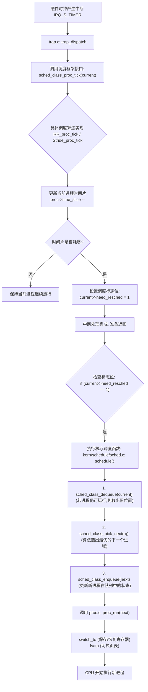

# 实验报告

## 练习 0：填写已有实验

本实验依赖实验 2/3/4/5 的成果。在 Lab 6 中，除了将之前的代码迁移外，还需要针对进程调度框架对`proc.c` 和 `trap.c` 进行关键修复。

### 1. 核心修复与改进

*   **`kern/process/proc.c` 中的 `alloc_proc`**：
    在 Lab 6 中，进程控制块（PCB）增加了调度相关字段。初始化代码如下：
    
    ```c
    // 初始化 Lab 6 引入的调度字段
    proc->rq = NULL;                            // 指向进程所属的运行队列
    list_init(&(proc->run_link));               // 初始化运行队列链表节点
    proc->time_slice = 0;                       // 初始化时间片
    // 初始化斜堆节点（用于 Stride 调度）
    proc->lab6_run_pool.left = proc->lab6_run_pool.right = proc->lab6_run_pool.parent = NULL;
    proc->lab6_stride = 0;                      // 初始步进值为 0
    proc->lab6_priority = 0;                    // 初始优先级为 0
    ```
```
    
*   **`kern/process/proc.c` 中的 `proc_run`**：
    实现进程切换时，需先切换页表（`lsatp`），再进行上下文切换（`switch_to`）。
    ```c
    void proc_run(struct proc_struct *proc) {
        if (proc != current) {
            bool intr_flag;
            struct proc_struct *prev = current;
            local_intr_save(intr_flag); // 禁用中断保证原子性
            {
                current = proc;
                lsatp(proc->pgdir);     // 加载新进程页表
                switch_to(&(prev->context), &(proc->context)); // 切换寄存器现场
            }
            local_intr_restore(intr_flag);
        }
    }
```

*   **`kern/trap/trap.c` 中的 `trap_dispatch`**：
    这是调度器的启动器。在时钟中断处理中，必须触发调度器的计时逻辑：
    
    ```c
    case IRQ_S_TIMER:
        // 调用具体调度算法的 tick 处理函数
        sched_class_proc_tick(current);
        break;
    ```

---

## 练习 1：理解调度器框架的实现

### 1.1 `sched_class` 结构体分析
`sched_class` 定义了调度算法的接口，实现了策略与机制的分离。

```c
struct sched_class default_sched_class = {
    .name = "RR_scheduler",
    .init = RR_init,
    .enqueue = RR_enqueue,
    .dequeue = RR_dequeue,
    .pick_next = RR_pick_next,
    .proc_tick = RR_proc_tick,
};
```

*   **`init`**: 初始化运行队列。在系统启动时通过 `sched_init` 调用一次。
*   **`enqueue`**: 进程变为就绪态（如被唤醒）时加入就绪队列。
*   **`dequeue`**: 进程被选中执行或进入等待态时移出队列。
*   **`pick_next`**: 核心函数，决定下一个占用 CPU 的进程。由 `schedule()` 调用。
*   **`proc_tick`**: 处理时钟中断计数。由 `trap_dispatch` 在每个时钟滴答调用。
**为什么使用函数指针？** 这种设计允许内核在不重新编译核心调度逻辑的情况下，通过简单修改指针指向来更换调度算法（如从 RR 切换到 Stride），极大提高了内核的可扩展性。

### 1.2 `run_queue` 结构体分析

```c
struct run_queue
{
    list_entry_t run_list;
    unsigned int proc_num;
    int max_time_slice;
    // For LAB6 ONLY
    skew_heap_entry_t *lab6_run_pool;
};
```


*   **Lab 5 vs Lab 6**: Lab 5 缺乏统一的就绪队列管理。Lab 6 引入了 `run_queue`，不仅包含进程总数，还支持了多种组织形式：
    *   **`run_list` (链表)**: 用于 RR/FIFO，方便实现先进先出。
    *   **`lab6_run_pool` (斜堆)**: 用于 Stride，方便以 $O(1)$ 时间获取 `stride` 最小的进程。
这种设计允许同一个调度器框架同时支持基于顺序和基于优先级的算法。

### 1.3 调度器框架函数分析

在 Lab 6 中，调度框架的核心在于**通过函数指针屏蔽了具体算法的差异**。以下分析 sched_init、wakeup_proc 和 schedule 的实现变化及解耦逻辑。

#### 1.3.1 sched_init (调度器初始化)

- **Lab 6 实现变化**：
  在该函数中，内核通过全局指针 sched_class 与具体的调度类（如 default_sched_class）建立关联。

  ```c
  void sched_init(void) {
      list_init(&timer_list);
      sched_class = &default_sched_class; // 关键：在此处指定调度算法
      rq = &__rq;                         // 全局运行队列
      sched_class->init(rq);              // 调用具体算法的初始化函数
  }
  ```

- **解耦原理**：内核不再硬编码任何算法。如果要更换调度算法，只需在 sched_init 中将 sched_class 指向不同的结构体（如 stride_sched_class），框架的其他部分完全不需要改动。

#### 1.3.2 wakeup_proc (唤醒进程)

- **Lab 6 实现变化**：
  在 Lab 5 中，唤醒进程只是简单地改变状态。在 Lab 6 中，唤醒操作必须通过调度框架进行。

  ```c
  void wakeup_proc(struct proc_struct *proc) {
      assert(proc->state != PROC_ZOMBIE);
      bool intr_flag;
      local_intr_save(intr_flag);
      {
          if (proc->state != PROC_RUNNABLE) {
              proc->state = PROC_RUNNABLE;
              proc->wait_state = 0;
              // 关键：将进程加入当前算法管理的运行队列中
              if (proc != current) {
                  sched_class_enqueue(proc);
              }
          }
      }
      local_intr_restore(intr_flag);
  }
  ```

- **解耦原理**：wakeup_proc 只负责设置状态，然后通过 sched_class_enqueue 这个“统一接口”把进程扔给调度算法。具体这个进程是排在链表末尾（RR）还是插入斜堆（Stride），wakeup_proc 函数本身并不知情。

#### 1.3.3 schedule (核心调度函数)

- **Lab 6 实现变化**：
  这是变化最大的地方。Lab 6 的 schedule 函数已经变成了一个纯粹的**逻辑外壳**。

  ```c
  void schedule(void) {
      bool intr_flag;
      struct proc_struct *next;
      local_intr_save(intr_flag);
      {
          current->need_resched = 0; // 重置标志位
          if (current->state == PROC_RUNNABLE) {
              sched_class_enqueue(current); // 重新入队
          }
          // 关键：不再遍历进程表，而是直接问算法：下一个是谁？
          if ((next = sched_class_pick_next(rq)) != NULL) {
              sched_class_dequeue(next);    // 从就绪队列移出选中的进程
          }
          if (next == NULL) {
              next = idleproc;              // 没得选就运行 idle
          }
          next->runs ++;
          if (next != current) {
              proc_run(next);               // 执行切换
          }
      }
      local_intr_restore(intr_flag);
  }
  ```

- **解耦原理**：在 Lab 5 中，schedule 需要自己遍历 proc_list 去找 RUNNABLE 的进程。在 Lab 6 中，这一过程被封装进了 sched_class_pick_next。算法如何挑选（是按先后顺序，还是看步长 stride）对 schedule 函数是透明的。这种设计极大地简化了核心代码，将算法逻辑完全剥离到了具体的 .c 文件中。

### 1.4 从内核启动到调度器初始化的完整流程

调度器的初始化是内核启动过程中的一个关键环节，其调用链如下：

1. **内核入口 (kern_init)**：
   内核启动后，在完成物理内存管理和虚拟内存管理初始化后，进入进程管理初始化。位置：kern/init/init.c。

   ```c
   // kern_init 函数片段
   vmm_init();                 // 虚拟内存管理初始化
   sched_init();               // 调度器框架初始化（关键步骤）
   proc_init();                // 进程管理初始化
   ```

2. **调度器框架初始化 (sched_init)**：
   该函数定义在 kern/schedule/sched.c 中。它是框架与具体算法关联的地方。

   - **设置调度算法**：将全局指针 sched_class 指向具体的调度算法结构体（如 default_sched_class）。
   - **初始化运行队列**：通过调度类的 init 接口初始化全局运行队列 rq。

   ```c
   void sched_init(void) {
       list_init(&timer_list);
       sched_class = &default_sched_class; // 关联具体算法（此时关联了 RR 算法）
       rq = &__rq;                         // 获取全局运行队列的引用
       sched_class->init(rq);              // 调用算法的初始化逻辑（如 RR_init）
       cprintf("sched class: %s\n", sched_class->name);
   }
   ```

3. **进程管理初始化 (proc_init)**：
   在调度器初始化完成后，proc_init 会创建 idleproc 和 initproc。当这些进程被设为“就绪态”（PROC_RUNNABLE）时，内核会调用 wakeup_proc，进而触发调度类的 enqueue 函数，将进程真正放入调度器管理的队列中。

### 1.5进程调度流程图




### 1.6 调度算法的切换机制

*   **修改位置**：只需修改 `kern/schedule/sched.c` 中的 `sched_init` 函数，将 `sched_class = &default_sched_class` 改为 `&stride_sched_class` 即可。
*   **为什么容易切换？** 归功于**接口抽象**。内核核心逻辑（如 `schedule()`、`wakeup_proc()`）只通过 `sched_class` 提供的通用接口（enqueue, pick_next等）操作，完全不依赖具体的算法细节。

---

## 练习 2：实现 Round Robin 调度算法

### 2.1 核心函数实现逻辑

```c
static void
RR_init(struct run_queue *rq)
{
    // LAB6: 2310984
    list_init(&(rq->run_list));
    rq->proc_num = 0;
}
static void
RR_enqueue(struct run_queue *rq, struct proc_struct *proc)
{
    // LAB6: 2310984
    assert(list_empty(&(proc->run_link)));
    list_add_before(&(rq->run_list), &(proc->run_link));
    if (proc->time_slice == 0 || proc->time_slice > rq->max_time_slice) {
        proc->time_slice = rq->max_time_slice;
    }
    proc->rq = rq;
    rq->proc_num ++;
}
static void
RR_dequeue(struct run_queue *rq, struct proc_struct *proc)
{
    // LAB6: 2310984
    assert(!list_empty(&(proc->run_link)) && proc->rq == rq);
    list_del_init(&(proc->run_link));
    rq->proc_num --;
}
static struct proc_struct *
RR_pick_next(struct run_queue *rq)
{
    // LAB6: 2310984
    list_entry_t *le = list_next(&(rq->run_list));
    if (le != &(rq->run_list)) {
        return le2proc(le, run_link);
    }
    return NULL;
}
static void
RR_proc_tick(struct run_queue *rq, struct proc_struct *proc)
{
    // LAB6: 2310984
    if (proc->time_slice > 0) {
        proc->time_slice --;
    }
    if (proc->time_slice == 0) {
        proc->need_resched = 1;
    }
}
```


*   **`RR_enqueue`**: 
    将进程加入运行队列末尾。如果进程的时间片非法或为 0，则根据运行队列的 `max_time_slice` 进行重置。使用 `list_add_before` 将节点插入到双向循环链表头节点的前面，即队尾。
*   **`RR_pick_next`**: 
    通过 `list_next` 获取链表的第一个有效节点（即队头），并使用 `le2proc` 宏将其转换为进程控制块。若队列为空则返回 `NULL`。
*   **`RR_proc_tick`**: 
    每次时钟中断，将 `current->time_slice` 减 1。当减至 0 时，将 `current->need_resched` 设为 1，强制触发调度。

### 2.2 实现中的关键代码分析
```c
// 选取下一个进程
static struct proc_struct *RR_pick_next(struct run_queue *rq) {
    list_entry_t *le = list_next(&(rq->run_list));
    if (le != &(rq->run_list)) { // 检查是否为空
        return le2proc(le, run_link);
    }
    return NULL;
}

// 时钟滴答处理
static void RR_proc_tick(struct run_queue *rq, struct proc_struct *proc) {
    if (proc->time_slice > 0) {
        proc->time_slice --;
    }
    if (proc->time_slice == 0) {
        proc->need_resched = 1; // 标记需要重新调度
    }
}
```

### 2.3 Lab 5 与 Lab 6 函数实现差异分析
*   **差异函数**: `kern/schedule/sched.c` 中的 `schedule()`。
*   **分析**: 在 Lab 5 中，`schedule` 往往是硬编码在循环里寻找下一个就绪进程。而在 Lab 6 中，`schedule` 彻底变为了框架层：它先关中断，然后调用 `sched_class->pick_next(rq)`。
*   **原因**: 做这个改动是为了实现**解耦**。如果不改动，每增加一种算法（如 Stride），就必须在 `schedule` 函数里写大量的 `if-else` 或 `switch` 逻辑，代码会变得不可维护且极难调试。

### 2.4 RR 调度算法分析
*   **优点**: 简单公平，能够有效防止长任务长期独占 CPU，保证交互式任务的响应。
*   **缺点**: 不支持优先级，对于实时性要求高的任务表现不佳。
*   **时间片调整**：太小会导致频繁的上下文切换（Cache失效，开销大）；太大会导致交互进程延迟增加。
*   **优先级 RR 修改**：
    1. 在 `proc_struct` 增加 `priority`。
    2. 在 `enqueue` 时根据优先级赋予不同的 `time_slice`（高优先级时间片更长）。
*   **多核调度**：当前 ucore 不支持。改进需：
    1. 为每个 CPU 维护独立的 `run_queue`。
    2. 引入自旋锁（Spinlock）保护共享资源。
    3. 实现负载均衡（Load Balancing）机制。

### 2.5  输出展示


---

## 扩展练习 Challenge 1：Stride Scheduling 调度算法

### 1.1 设计实现过程
Stride 算法通过 `stride` 值来竞争 CPU。每次调度选取 `stride` 最小的进程运行，运行后其 `stride` 会增加一个步长 $Pass = BIG\_STRIDE / Priority$。

*   **斜堆的应用**: 
    ```c
    // 选取最小步进进程
    struct proc_struct *p = le2proc(rq->lab6_run_pool, lab6_run_pool);
    // 更新其步进值
    if (p->lab6_priority == 0) {
        p->lab6_stride += BIG_STRIDE;
    } else {
        p->lab6_stride += BIG_STRIDE / p->lab6_priority;
    }
    ```
    使用斜堆可以在 $O(1)$ 时间内通过堆顶获取最小值，并在 $O(\log N)$ 时间内完成维护。

### 1.2 比例性证明
设进程 $A$ 优先级为 $P_A$，进程 $B$ 优先级为 $P_B$。
每次运行，$A$ 的步长增加 $S_A = K/P_A$，$B$ 增加 $S_B = K/P_B$。
系统倾向于让所有进程的 $stride$ 保持相等。设在时间 $T$ 内，$A$ 运行了 $n_A$ 次，$B$ 运行了 $n_B$ 次。
则 $n_A \times S_A \approx n_B \times S_B$
$\Rightarrow n_A \times (K/P_A) \approx n_B \times (K/P_B)$
$\Rightarrow n_A / P_A \approx n_B / P_B \Rightarrow n_A / n_B \approx P_A / P_B$。
**结论**：进程获得的 CPU 时间与其优先级成正比。

### 1.3 多级反馈队列（MLFQ）设计
1.  **队列组织**: 设置 $N$ 个就绪队列 $Q_0, Q_1, \dots, Q_{N-1}$，优先级从高到低。
2.  **调度规则**: 始终从最高优先级的非空队列中取进程运行。
3.  **动态升级/降级**:
    *   新进程进入 $Q_0$。
    *   若进程用完其时间片仍未完成，降入下一级队列 $Q_{i+1}$（时间片翻倍）。
    *   若进程因 I/O 主动放弃 CPU，则保持当前优先级。
    *   为防止饥饿，每隔一定时间（Priority Boost）将所有进程移回 $Q_0$。

---

## 扩展练习 Challenge 2：FIFO 实现与定量分析

### 1.1 FIFO 实现
FIFO 是最简单的非抢占式调度。
*   **实现要点**: `FIFO_proc_tick` 不做任何事，即不扣减时间片，也不设置 `need_resched`。
    
    ```c
    static void FIFO_proc_tick(struct run_queue *rq, struct proc_struct *proc) {
        // FIFO is non-preemptive, does nothing.
    }
    ```
*   **入队/选取**: 与 RR 类似，通过链表维护先进先出顺序。

### 1.2 定量分析比较

| 算法       | 平均响应时间          | 吞吐量        | 公平性          | 适用范围                       |
| :--------- | :-------------------- | :------------ | :-------------- | :----------------------------- |
| **FIFO**   | 差 (可能被长任务阻塞) | 高 (切换最少) | 差              | 批处理系统，短任务占比高的环境 |
| **RR**     | 优                    | 中            | 优              | 交互式分时系统                 |
| **Stride** | 优                    | 中            | 优 (确定性比例) | 需要精确 CPU 配额分配的系统    |

**测试设计**:
运行 5 个计算量相同的进程。
*   **RR**: 5 个进程几乎同时推进。
*   **FIFO**: 进程按 PID 顺序一个接一个跑完，总时间几乎相等，但前面的进程先退出。
*   **Stride**: 设置优先级 1:2:4:8:16，可以观察到优先级高的进程明显占据更多的进度条。
